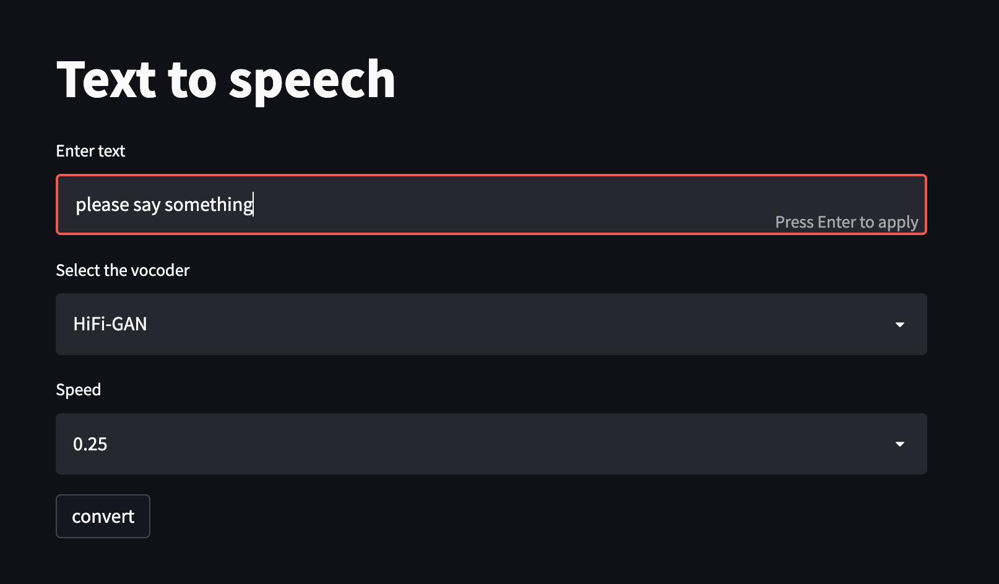

# Neural Speech Synthesis Using Transformers

Reference Paper: [Neural Speech Synthesis Using Transformers](https://arxiv.org/pdf/1809.08895.pdf)

Final Report: [report](Project%20Report%20ISE%20244.pdf)

### Problem Definition:
The problem I have implemented over the course of this project is based on Text-to-Speech (TTS). Text to Speech had 
gained a lot of prominence in various fields and had solved many real-world problems that we encounter in daily life. 
TTS has been a revelation right from the beginning, but it has become more powerful. With the advancement, we are able 
to generate intelligible and natural audios which are indistinguishable from human recordings. The main idea behind the 
project is to enable users to customize their lexicon to convey their thoughts, emotions, and requests in their 
day-to-day lives.  It immensely helps users with disabilities and impacts the way they communicate by relying on this 
technology to express their ideas and share with those around them. There are huge applications of TTS in our daily 
life, Among them, the most popular ones would be in our personal voice assistants and we also come across this in 
various google products such as (Ok Google, Google Translate, and Google Maps).

### Project Objectives: 
The main objective of this project is to build a text-to-speech application, such that generated audios are 
indistinguishable from the human voice. The TTS system mainly focuses on the following objectives:

* For the TTS system input is Text, so first, we need to preprocess the text such as removing special characters, syllable boundaries, and punctuations are also included as special markers. Then generate phoneme sequences for text which are used for input for the model training.
* Preprocess the audio files such as normalizing the audio frequencies, trimming the audio to a specified length, and then extracting the Mel-spectrograms. Store the extracted Mel-spectrograms which are useful for the training of the TTS model.
* Design and implement the TTS model according to this paper. For this project, I have used this repo as a reference. 
* Integrate HiFi-Gan vocoder with the TTS model. HiFI-Gan vocoder is used to generate the high-quality audios from the Mel-spectrograms.
* Integrate Griffin-Lim vocoder with the TTS model. Griffin-Lim vocoder is also used to generate the audios from the Mel-spectrograms.
* Design and implement the TTS system that can read out the text at any speed rate that the user specifies.
* Finally, built web-app using StreamLit for this TTS system.

#### Transformer TTS implementation taken from : https://github.com/soobinseo/Transformer-TTS

### Setting up project environment:
* Create new enviroment using annaconda or miniconda
```
conda create -n env_name python=3.6
```
* Activate conda enviroment
```
conda activate env_name
```
* Install dependencies using requirements.txt
```
pip install -r requirements.txt
```
### Pre-Trained LJSpeech API

* Inference using pre-trained model(Griffin-Lim Vocoder):
```
python predict_tts.py -t "Please, say something."
```
* After running the above command output audio file will be saved in the outputs directory

* Inference using pre-trained model(HiFi-Gan vocoder)
```
python predict_tts_vocoder.py -t "please say something" --voc hifigan
```

* To use the web-app run the following command
```
streamlit run app.py
```

### Results:
* Generated Audio Samples:
* For Text: Transformers were introduced in 2017 by a team at Google Brain and are increasingly the model of choice for NLP problems, replacing RNN models such as long short-term memory
  * Griffin-Lim Vocoder: [sample audio output](https://drive.google.com/file/d/1b9u9ONQ8aL3YHJwgIgqRslPMCptdOwFM/view?usp=sharing)
  * HiFi-Gan Vocoder: [sample audio output](https://drive.google.com/file/d/1CVvsT0wUcbkpSjsSYhw7N9TLD7_yF6Ev/view?usp=sharing)
* Screenshot of the Webapp:


